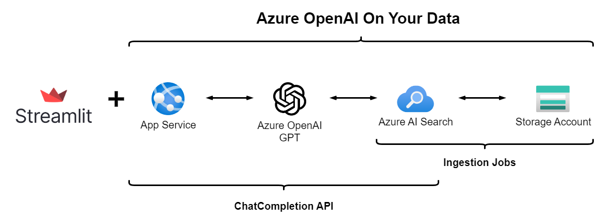

# Azure OpenAI On Your Data with Python Streamlit

This repository leverages Azure OpenAI's native [On Your Data](https://learn.microsoft.com/en-us/azure/ai-services/openai/concepts/use-your-data) feature and integrates it with [Streamlit](https://streamlit.io/), a robust framework for developing web applications purely in Python. The goal is to create an MVP for RAG with the most streamlined architecture possible.

[](https://codespaces.new/charliewei0716/on-your-data-with-streamlit?quickstart=1)


## Features

- [Optimal security architecture implementation](https://learn.microsoft.com/en-us/azure/ai-services/openai/how-to/use-your-data-securely#data-ingestion-architecture) with Managed Identity and [RBAC Configuration](https://learn.microsoft.com/en-us/azure/ai-services/openai/how-to/use-your-data-securely#role-assignments) in **On Your Data**.
- Automatically triggering of critical [Ingestion Jobs API](https://learn.microsoft.com/en-us/rest/api/azureopenai/ingestion-jobs) within **On Your Data** using [Bicep Deployment Scripts](https://learn.microsoft.com/en-us/azure/azure-resource-manager/bicep/deployment-script-bicep).
- Significantly reduces the data preprocessing engineering effort with [managed chunking & embedding processes](https://learn.microsoft.com/en-us/azure/ai-services/openai/concepts/use-your-data?view=rest-azureopenai-2024-05-01-preview&tabs=blob-storage%2Ccopilot#how-data-is-ingested-into-azure-ai-search) in **On Your Data**.
- The chat interface requires only a single [Azure OpenAI On Your Data ChatCompletion API](https://learn.microsoft.com/en-us/azure/ai-services/openai/references/on-your-data), eliminating the need for complex interactions with [Azure AI Search](https://learn.microsoft.com/en-us/azure/search/search-what-is-azure-search).
- RAG interactive web built with [Streamlit](https://streamlit.io/) framework in just 50 lines of pure Python code.

### Architecture Diagram



## Getting Started

1. This repository has been optimized for GitHub codespaces. Please use the following badge to open a web-based version of VS Code in your browser.

   [](https://codespaces.new/charliewei0716/on-your-data-with-streamlit?quickstart=1)
3. Login to your Azure account:
    ```
    azd auth login --use-device-code
    ```
4. Provision Azure resources and deploy the application code:
    ```
    azd up
    ```
    - Enter the environment name, Azure Subscription, and the location of the Azure resources one by one as instructed.
    - This process involves uploading the test document `./data/employee_handbook.pdf` to an Azure Storage Account and triggering the **Ingestion Jobs** task within **On Your Data**.
5. Setting Up a Python development environment and running web application:
    ```
    cd app
    . start.sh
    ```
    If you are in GitHub codespaces, you will see the automatically opened preview browser on the right-hand side.
6. Redeploy the updated program:
   ```
   azd deploy
   ```
   Repeat steps 5 and 6 and enjoy your development process!
